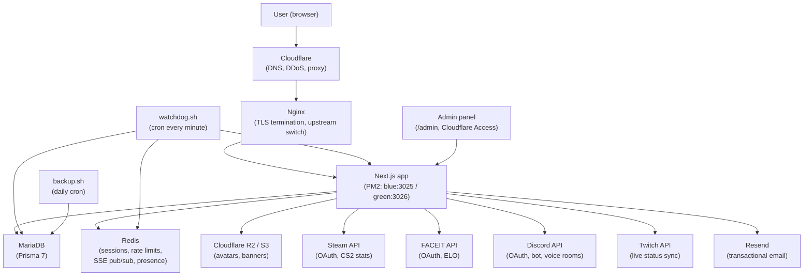

# maybe.hu

A matchmaking platform for Hungarian CS2 players. Find teammates by ELO, availability, and playstyle, without digging through Discord channels.

**Live:** [maybe.hu](https://maybe.hu) &nbsp;|&nbsp; **Status:** Active, early-stage &nbsp;|&nbsp; ~190 registered users, ~5.1k unique visitors/30 days (Cloudflare)

---

## What it is

maybe.hu is a session-based LFG (looking for group) platform targeting Hungarian CS2 players. Players set an active session (game mode, ELO, how long they're available) and appear on a filterable live board. Other players can browse, message, and connect directly.

Beyond LFG, the platform includes direct messaging, team and squad creation, streamer partnerships with live OBS overlays, a points system, and a full admin panel for moderation.

---

## Why I built it

The main CS2 LFG platforms for Hungarian players (teams.gg shut down in 2023) either died or never existed in a usable form. What remained was people manually typing `@Premier 15k +2` into Discord channels all day, with messages disappearing in minutes.

I built maybe.hu to solve that specific problem: a structured, filterable, session-based alternative to Discord chaos.

---

## Screenshots

*Coming soon: player discovery board, profile / session view, admin analytics dashboard.*

---

## Core product

**LFG & matching**
- Session-based board: premier, FACEIT, wingman, deathmatch, casual
- Filter by ELO, FACEIT level, availability, mic, role
- Session scheduler: set recurring availability windows, platform starts/stops sessions automatically
- Recommendation engine: weighted scoring by skill delta, session overlap, and activity

**Profiles & integrations**
- Steam OAuth with CS2 stats pull (hours, kills, wins, headshot %)
- FACEIT OAuth with ELO and level sync
- Discord and Google OAuth
- Avatar and banner upload

**Messaging & teams**
- Direct messages with typing indicators and reactions
- Discord voice room creation from within a DM
- Squads: temporary team-ups with applications
- Teams: persistent 5-player rosters with minimum rank requirements

**Moderation & admin**
- Report system for messages, users, and squads
- Admin panel: user management, ban/unban, message moderation, report queue
- System banners, bulk email, admin inbox

**Streamer partnerships**
- Tracked referral links with click-to-registration conversion attribution
- Per-streamer customized OBS overlays
- Twitch live status sync

---

## My role

I am not primarily a developer on this project. My contributions were:

- **Product direction:** defined what the platform is, what it is not, and what to build next
- **Feature prioritization:** decided what shipped and what was cut or parked
- **UX decisions:** flows, copy, interaction design, visual language
- **AI-assisted implementation coordination:** directed AI coding agents, reviewed outputs functionally, coordinated changes across sessions
- **Deployment and operations:** set up and maintain the Linux VPS, nginx, PM2, deploy pipeline, monitoring
- **Partner and streamer relations:** recruited partners, built overlay integrations, managed the program
- **Moderation:** handled reports, user issues, ban decisions
- **Analytics-driven decisions:** used the admin dashboard to understand user behavior and prioritize accordingly

## AI-assisted development

Most implementation work was done with AI coding agents under my direction. I defined product behavior, wrote the specs, reviewed outputs functionally, coordinated changes, handled all deployment and operations, and owned every product decision.

Implementation quality varies across areas, which is one reason I keep production safeguards, monitoring, and iterative audits around the system.

---

## Architecture

**Single VPS.** Both PM2 slots (blue, green) and both databases run on the same server. No distributed setup, no managed cloud DB.

**Stack:** Next.js 15 / React 19 / TypeScript, MariaDB + Prisma 7, Redis, PM2, Nginx, Cloudflare

---

## Production decisions

The private production repository uses a blue-green deploy setup, a health check endpoint, and a watchdog. A few decisions worth noting:

**Blue-green deploy with grace period.** Given SSE connections with 55-second max_age, the deploy waits 120 seconds after switching the nginx upstream before terminating the old slot. This drains active connections without hard-cutting users.

**sessionVersion for password reset invalidation.** Rather than a timestamp-based denylist, password reset increments an integer in the DB. Every JWT carries the version at issue time. Mismatch means invalid. Simple, correct, no cleanup needed.

**Deep health checks with component-level status.** The watchdog distinguishes "app degraded but DB+Redis up, reload may help" from "DB or Redis actually down, do not reload, wait instead." This prevents thrash-reloading during infrastructure failures.

**Redis rate limiting with process-local fallback.** If Redis goes down, the rate limiter switches to a process-local in-memory sliding window, preserving basic rate limiting with reduced guarantees. On the current single-instance deployment the fallback still provides basic protection, but it does not persist across restarts and would not be shared across multiple instances.

**IP hashing at write time.** HMAC-SHA-256 with a server secret applied before any IP is written to DB. Plaintext IPs never land in the database.

**15 incremental migrations** with additive changes kept separate from cleanup. Legacy fields are explicitly marked in the schema for future removal.

---

## Real-world usage

- ~190 registered users
- ~5,100 unique visitors over 30 days (Cloudflare analytics)
- Real user messages and sessions, not just registrations
- Active streamer partner integrations with live OBS overlays in use

This is an early-stage, niche product. The numbers reflect a specific Hungarian CS2 audience, not a broad gaming platform.

---

## Lessons learned

**Liquidity problem is real.** A matching platform with 20 concurrent users does not feel alive. The hardest thing was not building features. It was getting enough people online at the same time to validate the core loop.

**Rollback matters.** Blue-green deploy was added after an incident where a broken build took the site down. Having a previous release to switch back to makes the difference.

**Session invalidation is harder than it looks.** The first implementation used a timestamp. After hitting edge cases with clock precision, it was replaced with an integer version counter. Simpler and correct.

**Rate limiting saved real headaches.** Some endpoints got hammered early on. Having a reusable rate limit helper made it easy to add protection everywhere quickly.

**User behavior over feature count.** Analytics showed users spending time on profile browsing and DMs more than on the elaborate squad and team systems. The most-used features were not the most complex ones.

**Monitoring before you need it.** The health endpoint and watchdog were added reactively. Earlier would have been better.

---

## Known limitations

- **Small user base.** The platform's core feature requires concurrent users. At current scale, the LFG board is often sparse.
- **Single VPS, no high availability.** Blue-green reduces deploy downtime, but a hardware failure takes everything down. There is no standby server.
- **AI-assisted code, variable depth.** The codebase is functional, but technical consistency varies across areas.
- **No automated test suite.** Correctness relies on functional review and production monitoring rather than unit or integration tests.
- **Some features are parked.** The lobby matchmaking system and a few other features exist but are not primary flows.

---

## Status

Active and maintained. Core features are stable, product direction is still being shaped by user behavior.

---

## Contact

Built by **Nalvo** · [nalvo.hu](https://nalvo.hu)
