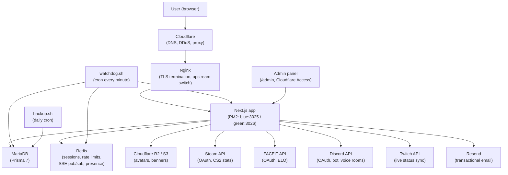

# maybe.hu

Hungarian CS2 players used to find teammates by typing `@Premier 15k +2` into a Discord channel and hoping someone saw it before it drowned.

maybe.hu fixes that.

**Live:** [maybe.hu](https://maybe.hu) &nbsp;|&nbsp; ~215 registered users &nbsp;|&nbsp; ~5.1k unique visitors / 30 days

---

## The problem

teams.gg shut down in 2023. Nothing replaced it. What remained was Discord channels full of messages that disappeared in minutes, no filtering, no structure, no way to know if anyone online was even looking for the same thing as you.

The Hungarian CS2 scene is small enough that a niche platform can serve it. Small enough that it actually needed one.

---

## What it does

Players set an active session — game mode, ELO, how long they're available — and appear on a live filterable board. Other players browse, message, and connect directly. No signup walls between browsing and finding someone.

Beyond LFG:

- **Direct messages** with typing indicators, reactions, and Discord voice room creation from within a DM
- **Squads** (temporary team-ups with applications) and **Teams** (persistent 5-player rosters with rank floors)
- **Steam + FACEIT OAuth** with ELO and CS2 stats pulled automatically, not self-reported
- **Session scheduler** with recurring availability windows. The platform starts and stops your session automatically.
- **Recommendation engine** weighted by skill delta, session overlap, and activity
- **Streamer partnerships** with 11 active OBS overlays in production, tracked referral links, and Twitch live sync
- **Giveaway system** with weekly draws and cryptographically verifiable randomness (Web Crypto API, public seed, SHA-256)
- **Push notifications + PWA** installable, works offline
- **Admin panel** with full moderation suite, report queue, bulk email, and system banners

---

## Numbers

- ~215 registered users
- ~5,100 unique visitors over 30 days (Cloudflare analytics)
- Real sessions and messages, not just registrations
- 11 active streamer partner integrations with live OBS overlays

Early stage, narrow audience. The numbers are honest.

---

## How it's built

```mermaid
graph TD
    User["User (browser)"] --> CF["Cloudflare\n(DNS, DDoS, proxy)"]
    CF --> Nginx["Nginx\n(TLS termination, upstream switch)"]
    Nginx --> App["Next.js app\n(PM2: blue:3025 / green:3026)"]
    App --> DB["MariaDB\n(Prisma 7)"]
    App --> Redis["Redis\n(sessions, rate limits,\nSSE pub/sub, presence)"]
    App --> R2["Cloudflare R2 / S3\n(avatars, banners)"]
    App --> Steam["Steam API\n(OAuth, CS2 stats)"]
    App --> FACEIT["FACEIT API\n(OAuth, ELO)"]
    App --> Discord["Discord API\n(OAuth, bot, voice rooms)"]
    App --> Twitch["Twitch API\n(live status sync)"]
    App --> Resend["Resend\n(transactional email)"]
    Watchdog["watchdog.sh\n(cron every minute)"] --> App
    Watchdog --> DB
    Watchdog --> Redis
    Backup["backup.sh\n(daily cron)"] --> DB
    Admin["Admin panel\n(/admin, Cloudflare Access)"] --> App
```

Single VPS. Blue-green PM2 slots, both databases on the same machine. No managed cloud DB, no distributed setup. Deliberate for this stage.

**Stack:** Next.js 15 / React 19 / TypeScript · MariaDB + Prisma 7 · Redis · PM2 · Nginx · Cloudflare

---

## Production decisions worth noting

**Blue-green deploy with a grace period.** SSE connections have a 55-second max_age. The deploy waits 120 seconds after switching the nginx upstream before killing the old slot. Drains connections instead of cutting them.

**sessionVersion for password reset invalidation.** Password reset increments an integer in the DB. Every JWT carries the version it was issued at. Mismatch means invalid. No denylist, no cleanup, no timestamp edge cases.

**Deep health checks.** The watchdog distinguishes "app degraded but DB+Redis up, reload may help" from "DB or Redis actually down, do not reload, wait." Prevents thrash-reloading during infrastructure failures.

**Redis rate limiting with process-local fallback.** If Redis goes down, the rate limiter falls back to an in-memory sliding window. Reduced guarantees, but the endpoint doesn't go unprotected.

**IP hashing at write time.** HMAC-SHA-256 with a server secret before any IP touches the database. Plaintext IPs never land in storage.

**15 incremental migrations** with additive changes kept separate from cleanup. Legacy fields are marked in the schema for future removal.

---

## My role

I'm not primarily a developer. What I did:

- Defined the product, what it is, what it isn't, and what gets built next
- Made every feature prioritization and UX decision
- Ran all deployment and operations: VPS, nginx, PM2, deploy pipeline, monitoring
- Recruited and managed streamer partners, built the overlay integrations
- Handled moderation, reports, and ban decisions
- Used analytics to understand what users actually do vs. what I thought they'd do

Implementation was done with AI coding agents under my direction. I wrote the specs, reviewed outputs, coordinated changes across sessions, and owned every production decision. The codebase reflects that process. Functional, but uneven in places, which is why the monitoring and safeguards exist.

---

## What I learned

**The liquidity problem is real.** A matching platform with 20 concurrent users doesn't feel alive. The hardest part wasn't building features. It was getting enough people online at the same time to validate the core loop.

**Rollback before you need it.** Blue-green was added after a broken build took the site down. Having a previous working release to switch back to makes the difference between an incident and a minute of downtime.

**User behavior over feature count.** Analytics showed users spending time on profile browsing and DMs, not on squads or teams. The most-used features weren't the most complex ones.

**Monitoring before you need it.** The health endpoint and watchdog were added reactively. Earlier would have been better.

---

## Known limitations

- **Small user base.** The core feature needs concurrent users. The LFG board is often sparse at this scale.
- **Single VPS, no HA.** Blue-green reduces deploy downtime, not hardware failure.
- **No automated test suite.** Correctness relies on functional review and production monitoring.
- **Some features are parked.** The lobby matchmaking system exists but isn't a primary flow.

---

## Status

Active and maintained. Core features are stable. Product direction is still being shaped by what users actually do.

---

## Contact

Built by **Nalvo** · [nalvo.hu](https://nalvo.hu)
